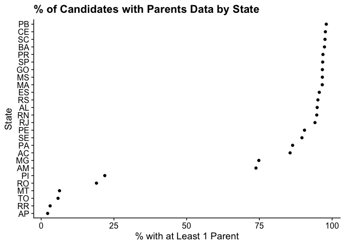

Descriptive Statistics
================

## Coverage of Parents Data

Currently, we have extracted the parents data for mayoral candidates
from the 2020 elections. The percentage of candidates with parents data
can be found in the following table.

| Candidate Status | at least 1 parent | 2 parents |
|:-----------------|------------------:|----------:|
| 2nd Round        |              90.4 |      76.3 |
| Elected          |              83.4 |      66.8 |
| Not Elected      |              84.2 |      66.1 |

% of Candidates with Parents Data

The percentage of candidates with parents data by state can be found in
the following plot.
<!-- -->
